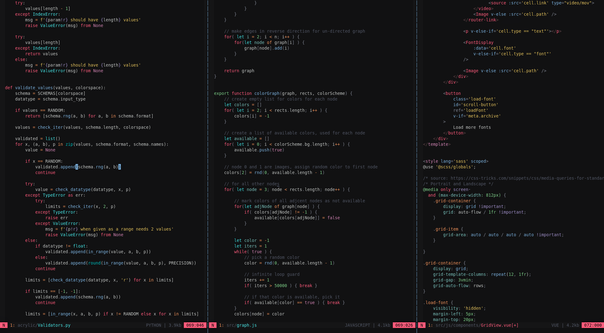

# :telescope: asteroid.vim

asteroid is a dark 24-bit truecolor colorscheme for neovim and vim.  
<br>



# Install

### Native vim package (vim 8+)
Run the following command to install:
``` sh
git clone https://github.com/prdx23/asteroid.vim ~/.vim/pack/plugins/start/asteroid.vim
```

### [vundle](https://github.com/VundleVim/Vundle.vim)
Add to your `.vimrc`:
``` vim
Plugin 'prdx23/asteroid.vim'
```

### [vim-plug](https://github.com/junegunn/vim-plug)
Add to your `.vimrc`:
``` vim
Plug 'prdx23/asteroid.vim'
```

### [pathogen](https://github.com/tpope/vim-pathogen)
Run the following command to install:
``` sh
git clone https://github.com/prdx23/asteroid.vim ~/.vim/bundle/asteroid.vim
```

### Manual Install
Copy the `colors` and `autoload` folders into your `.vim` folder


# Configuration

When using in a terminal, make sure the terminal supports 24-bit truecolors 
or the colors might look a little off. After installation, 
add the following in your `.vimrc`:
``` vim
syntax on

if (has("termguicolors"))
    set termguicolors
endif

colorscheme asteroid
```

### Airline theme
asteroid includes a theme for airline, to use it add the following to
your `.vimrc`:
``` vim
let g:asteroid_airline = 1
let g:airline_theme = 'asteroid'
```

### Lightline theme
asteroid includes a theme for lightline, to use it add the following to
your `.vimrc`:
``` vim
let g:asteroid_lightline = 1
" set lighline theme (in your lightline config)
let g:lightline = { 'colorscheme': 'asteroid' }
```

# Credits

- Themes that inspired me:
    - [mhartington/oceanic-next](https://github.com/mhartington/oceanic-next)
    - [Rigellute/rigel](https://github.com/Rigellute/rigel)
    - [joshdick/onedark.vim](https://github.com/joshdick/onedark.vim)
    - [sainnhe/sonokai](https://github.com/sainnhe/sonokai)
    - [pineapplegiant/spaceduck](https://github.com/pineapplegiant/spaceduck)
- [estilo](https://github.com/jacoborus/estilo): An awesome colorscheme manager


---
**MIT License**: Copyright (c) 2022 Arsh   |  [License.txt](https://github.com/prdx23/asteroid.vim/blob/master/LICENSE.txt)
